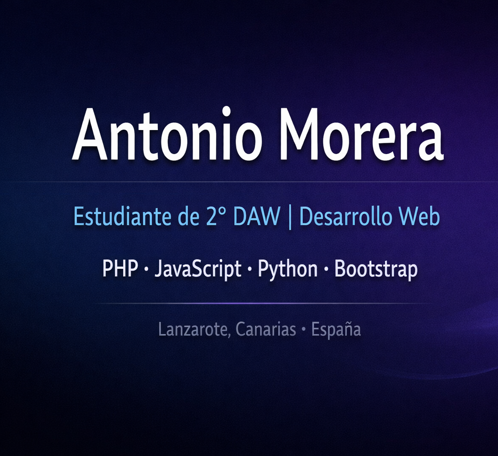

  <h1 align="center">Hola, soy Antonio 👋</h1>
  <h3 align="center">Estudiante de 2º DAW | Desarrollo Web</h3>
  
📍 Lanzarote, Canarias (España)

---

## 🚀 Sobre mí

- 🎓 Estudiante de **2º Desarrollo de Aplicaciones Web**
- 💻 Desarrollo principalmente con **PHP** y **JavaScript**
- 🐍 Conocimientos en **Python**
- 🎨 Uso **Bootstrap** para maquetación
- 🧩 He utilizado **Vue** en uno de mis proyectos
- 🖥️ Windows en casa y **Linux** en clase (con intención de usar Linux como sistema principal)

---

## 🛠 Tecnologías

  
  
  
  
  

---

## 💻 Entorno de trabajo

- 🪟 **Windows** (uso personal)
- 🐧 **Linux** (entorno de clase y futuro sistema principal)
- 🧰 Visual Studio Code
- 🗄️ Git & GitHub

---

## 📌 Proyectos destacados

<table>
<tr>
<td width="50%">
<h3 align="center">ExámenesTest</h3>

Aplicación para realizar y gestionar exámenes tipo test.

<strong>PHP / JavaScript</strong>

</td>

<td width="50%">
<h3 align="center">Puzzles 3D</h3>

Proyecto sencillo de puzzles en 3D.

<strong>JavaScript</strong>

</td>
</tr>
</table>

---

## ⚙️ GitHub Analytics

